<h1><b>AI Trademark Logo Creator</b></h1>
<h6>Powered by: Hilton Technology Sdn. Bhd.</h6>

  

Project Manager  : Khaw Teng Xian B031910447  
Quality Manager : Lim Wen Ni B031910441 
Financial Analyst  : Reca Seng binti Mohd Fadzil Seng B031910187  

<h2>Project Description</h2>

This project is focusing on creating the unique design of the logo. A logo or a brand is a very important sign for a company. We can identify the service or product that the company sell through their trademark logo. The trademark logo may be designed with a combination of icon, word, image, symbol or colour. But this project is more focused on customizing a unique font design for a trademark logo. Thus, the project's purpose is to create a unique trademark logo which to avoid the problems with misidentification and plagiarism of trademarks. Therefore, we are able to design your own company trademark logo by typing your company name, adjusting the customize options and then selecting the desired font style on your own. Now, your unique trademark logo will be created.

<h2>Project Definition</h2>
<h6>Customer: PROF. Ts. DR. GOH ONG SING, BigSoft International Sdn. Bhd. and MyIPO</h6>
<h6>Project title: AI Trademark Logo Creator</h6>
<h6>Project Manager  : Khaw Teng Xian B031910447  
Quality Manager : Lim Wen Ni B031910441 
Financial Analyst  : Reca Seng binti Mohd Fadzil Seng B031910187  </h6>
<h6>Objectives:</h6>
<h6>1. To develop a system that can generate a list word styles that contains the related characteristics.</h6>
<h6>2. To generate a list of colours that can be used together as the colours will looks good together.</h6>
<h6>3. To develop a system that can improve the creativity in creating a logo.</h6>

<h2>Project Planning</h2>
<h3>Gantt Chart</h3>

  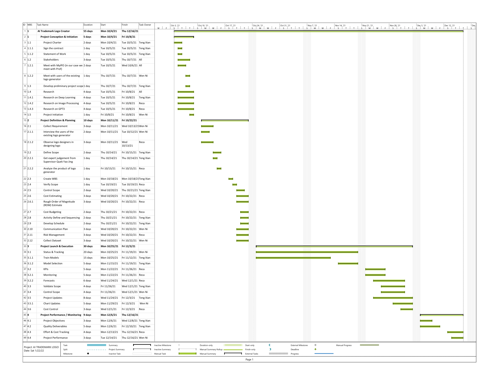

<h3>Work Breakdown Structure (WBS)</h3>

  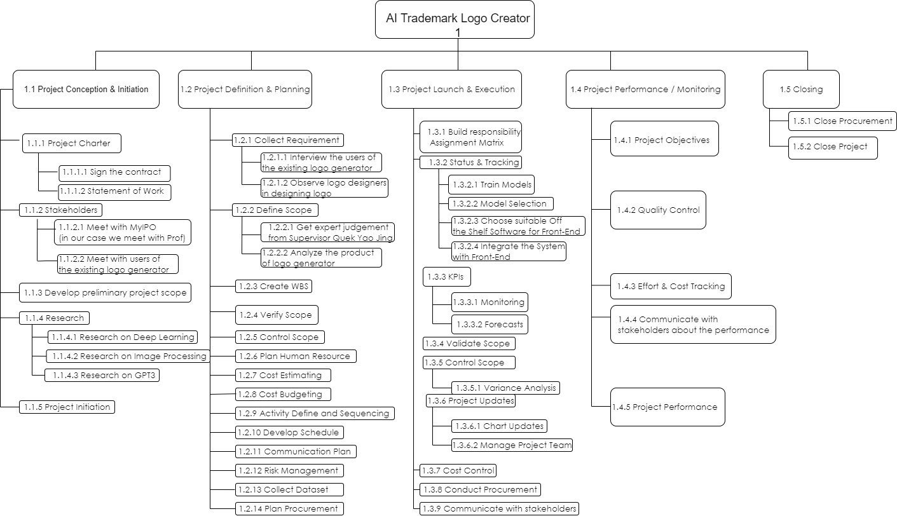

<h3>Responsibility Assignment Matrices (RAM)</h3>

  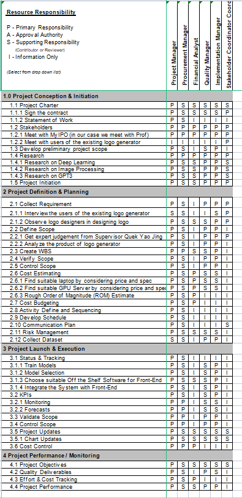

<h3>Roles & Resposibility</h3>

  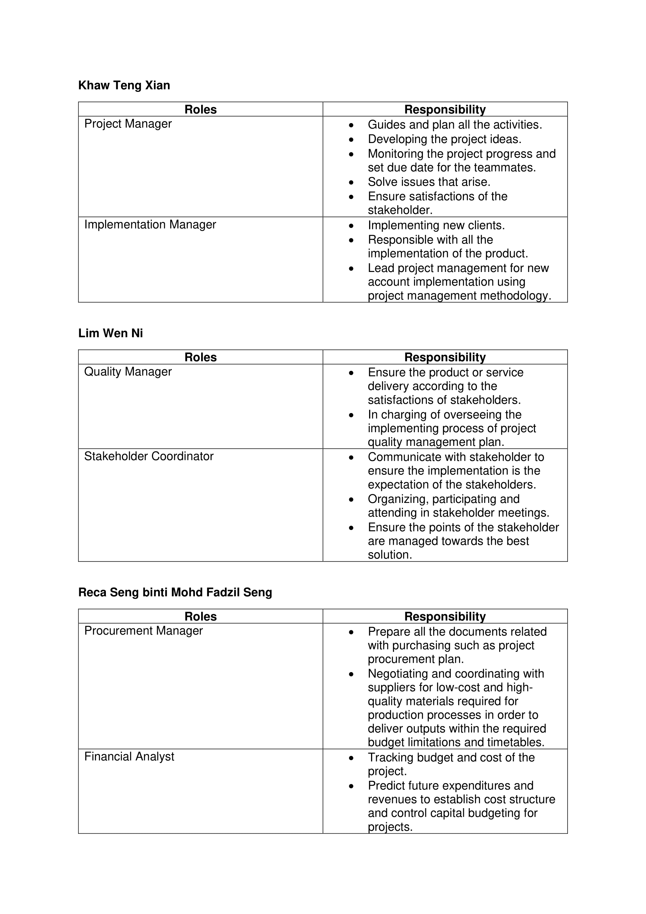

<h3>Risk Identification Chart</h3>

Control Element | What is likely to go wrong? | How and when will I know? | What will I do about it?
---|---|---|---
Quality|The result is very subjective. As the classification of data is done manually. Not all people can agree with the result.| The system generates an unexpected logo during testing.| Do survey about the style and update the dataset. 
Cost| Choosing the wrong laptop or server spec and may lead to buy another laptop again.|During implementation, if our laptop cannot support the system, then it means we bought an unsuitable laptop.|Do more research about the suitable laptop or server spec for training a model.
Time|Not enough time to implement a more mature system. This is because of time consuming in training the model. | If we can’t get a model in the scheduled time during implementation|Use pretrained model instead of train from scratch

<h1><b>Implementation of Project Plan</b></h1>

Deliverables:

<h6>•  A system that can suggest the word styles and colours for the user</h6>

<h3>Tasks and Estimated Costs</h3>

  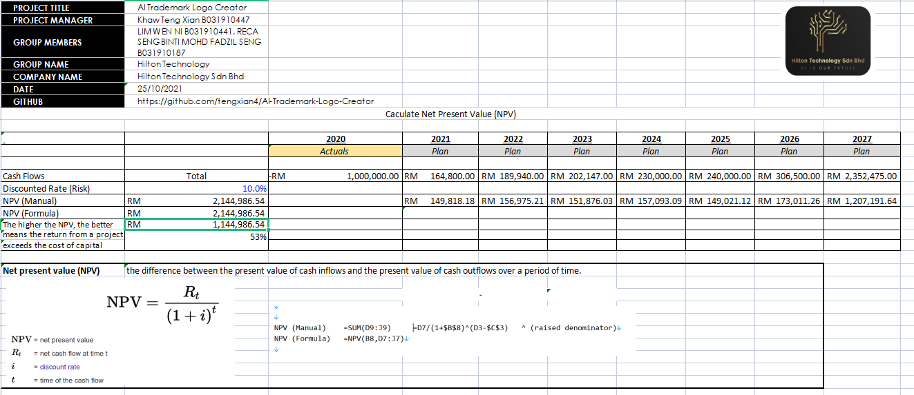
  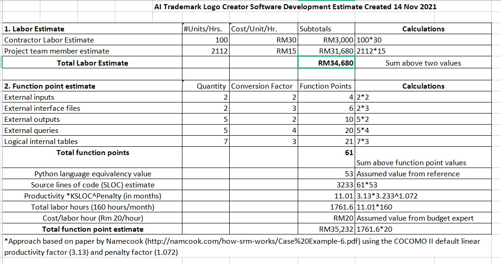
  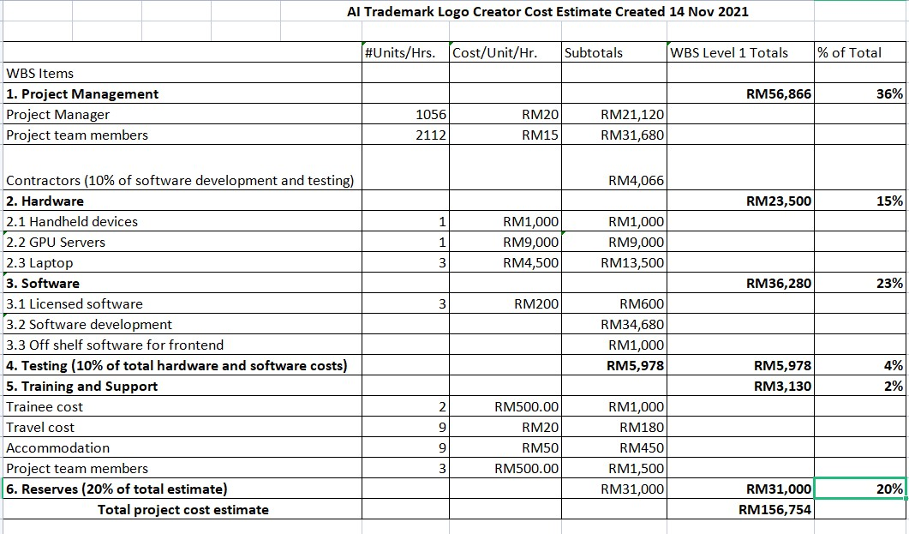

<h3>Milestone Chart</h3>

  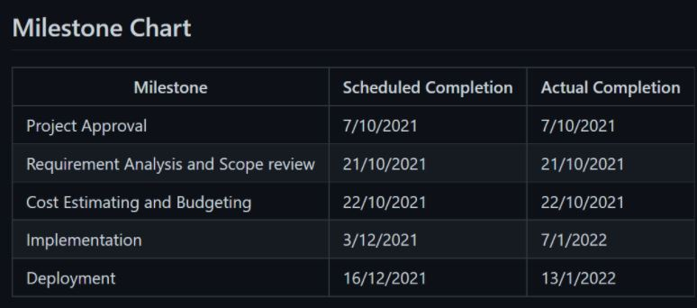

<h1><b>Executing the project</b></h1>
<h3><b>Project Design and coding</b><h3>
<h4>Flow Chart:</h4>

  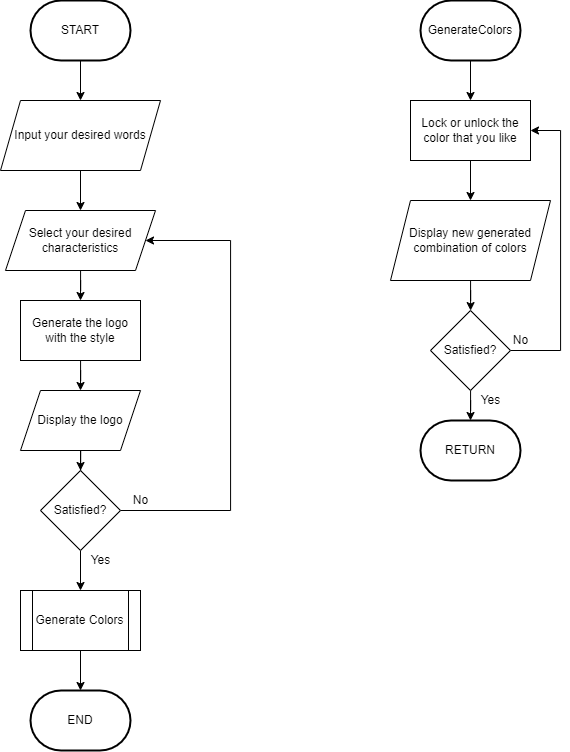

<h4>GUI of Logo Creator:</h4>
  

  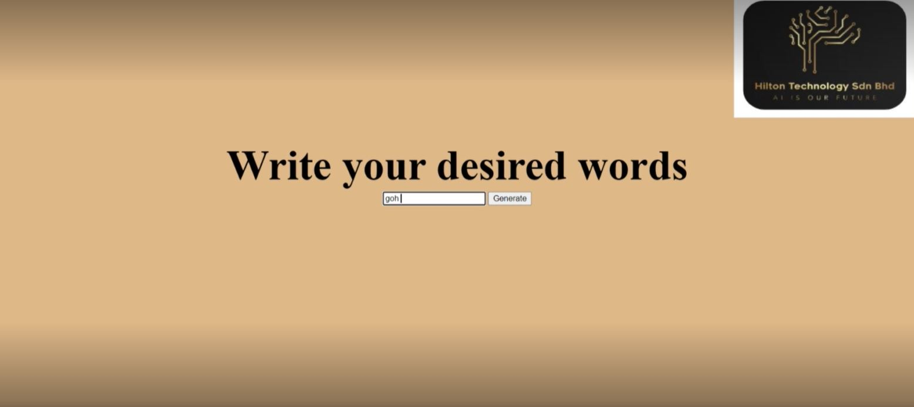

<h4>Project Result:</h4>

  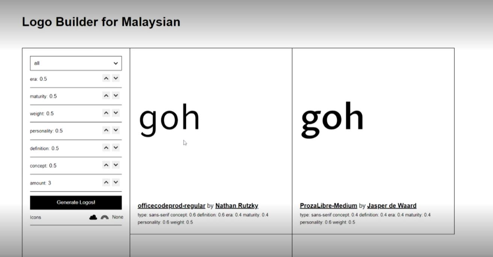

<h4>Project Code:</h4>

  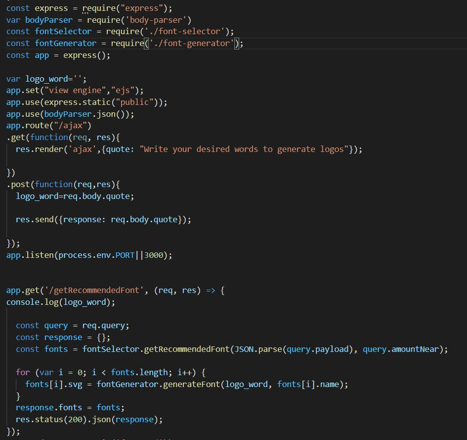

<h1><b>Project Closing</b></h1>
<h3>Customer Acceptance Form</h3>

  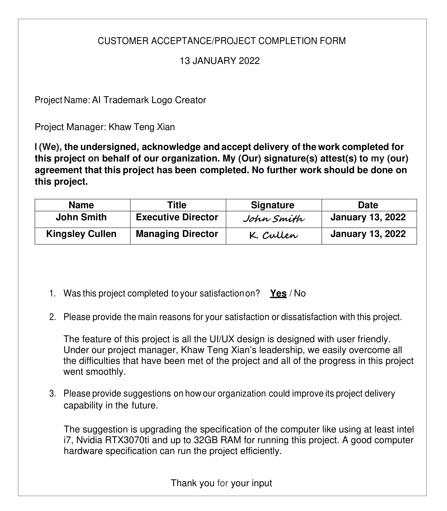

<h3>Lessons-Learned Form</h3>

  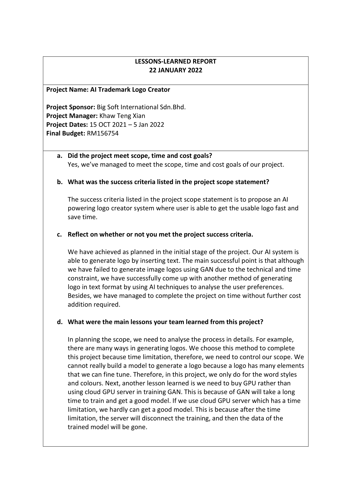

  
<h1><b>Final Project Report</b></h1>
  
<b>1.0 Project Objectives:</b> The AI trademark logo creator project are done by Hilton Technology Sdn. Bhd. was intended to develop an artificial intelligence system that are able to generate a unique trademark logo for a company. It can help to customize your own unique trademark logo and make sure its uniqueness and avoid from plagiarism. We also intend to build a simple website GUI for the future ease in creating a unique trademark logo. 

  
<b>2.0 Summary of Project Results:</b> Upon the project is finished, we manage to build an intelligent system that are able to customize a unique trademark logo by user. 

 
  
<b>3.0 Original and Actual Schedule</b>

  

  

  
  
<b>4.0 Original and Actual Budget</b>

  
4.1 Cost Estimation:

    

  

 
4.2 NPV value:

  

  
<b>5.0 Transition Plan</b>

  
The staff from Hilton Technology Sdn. Bhd. will provide fully support when required. The staff provide the supports for the system are shown as below:

  
i.  System maintenance service.

  
ii.  System update and error handling service.

  
iii.  Collect and report the feedback from the user to management in order to improve system.

  <h1><b>Close Contract</b></h1>
  

  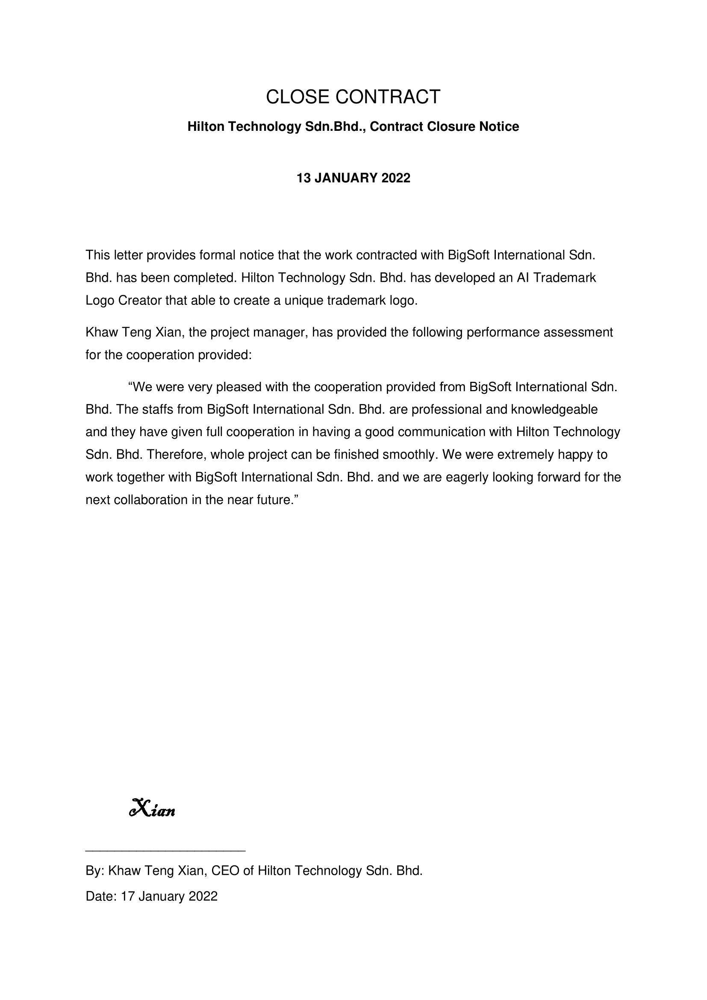

  
  <h1><b>Project Presentation</b></h1>
  <h3><b>Presentation Video</b></h3>
  Click [here](-URL PUT HERE-)
  
