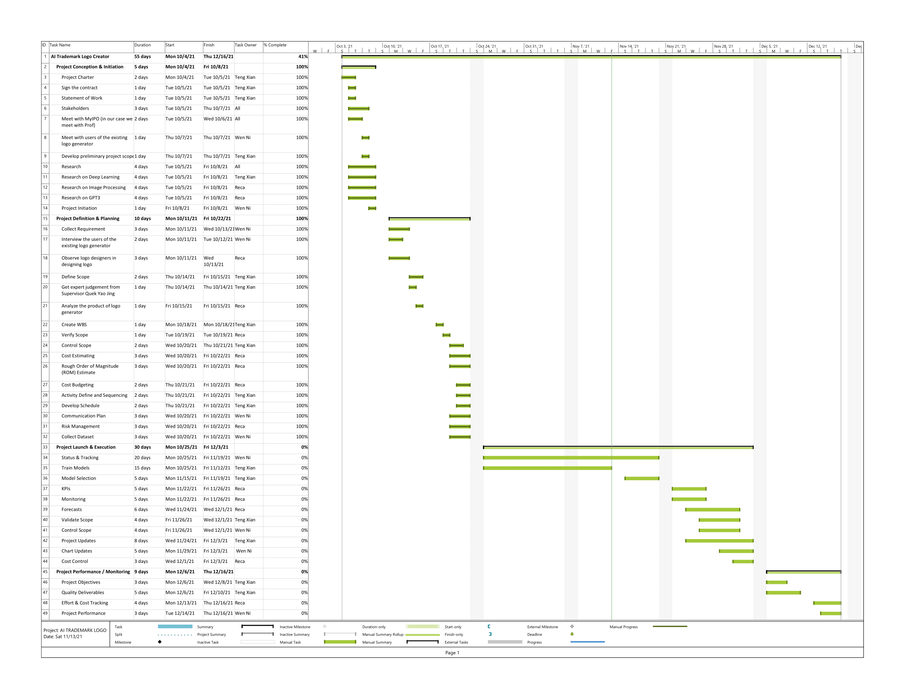

<h1><b>AI Trademark Logo Creator</b></h1>
<h6>Powered by: Hilton Technology Sdn. Bhd.</h6>

  

Project Manager  : Khaw Teng Xian B031910447  
Quality Manager : Lim Wen Ni B031910441 
Financial Analyst  : Reca Seng binti Mohd Fadzil Seng B031910187  

<h2>Project Description</h2>

This project is focusing on creating the unique design of the logo. A logo or a brand is a very important sign for a company. We can identify the service or product that the company sell through their trademark logo. The trademark logo may be designed with a combination of icon, word, image, symbol or colour. But this project is more focused on customizing a unique font design for a trademark logo. Thus, the project's purpose is to create a unique trademark logo which to avoid the problems with misidentification and plagiarism of trademarks. Therefore, we are able to design your own company trademark logo by typing your company name, adjusting the customize options and then selecting the desired font style on your own. Now, your unique trademark logo will be created.

<h2>Project Definition</h2>
<h6>Customer: PROF. Ts. DR. GOH ONG SING, BigSoft International Sdn. Bhd. and MyIPO</h6>
<h6>Project title: AI Trademark Logo Creator</h6>
<h6>Project Manager  : Khaw Teng Xian B031910447  
Quality Manager : Lim Wen Ni B031910441 
Financial Analyst  : Reca Seng binti Mohd Fadzil Seng B031910187  </h6>
<h6>Objectives:</h6>
<h6>1. To develop a system that can generate a list word styles that contains the related characteristics.</h6>
<h6>2. To generate a list of colors that can be used together as the colors will looks good together.</h6>
<h6>3. To develop a system that can improve the creativity in creating a logo.</h6>

<h2>Project Planning</h2>
<h3>Gantt Chart</h3>

  

<h3>Responsibility Assignment Matrices (RAM)</h3>

  

<h4>Roles & Resposibility</h4>

<b>Khaw Teng Xian</b>
Roles | Responsibility
---|---
Project Manager |  Guides and plan all the activities
Implementation Manager | Responsible with all the implementation of the product

<b>Lim Wen Ni</b>
Roles | Responsibility
---|---
Quality Manager | Ensure the quality of the process and product of the project
Stakeholder Coordinator | Communicate with stakeholder to ensure the implementation is the expectation of the stakeholders

<b>Reca Seng binti Mohd Fadzil Seng</b>
Roles | Responsibility
---|---
Procurement Manager | Prepare all the documents related with purchasing
Financial Analyst | Tracking budget and cost of the project
